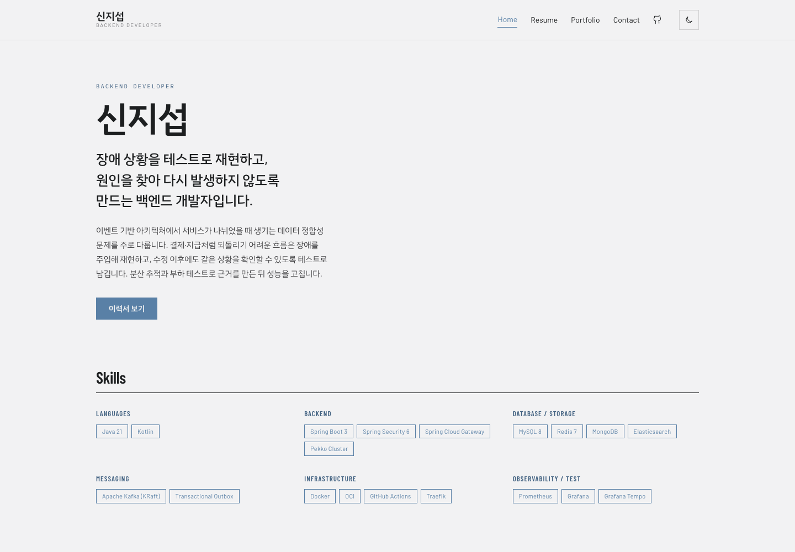
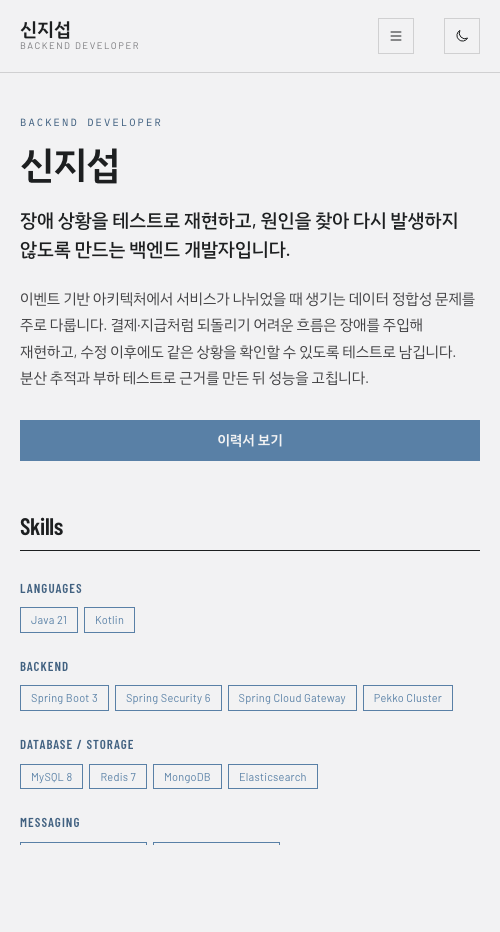

# 신지섭 포트폴리오

순수 HTML, CSS, JavaScript로 만든 반응형 백엔드 개발자 포트폴리오입니다. 프레임워크나 빌드 도구 없이 시맨틱 마크업, 반응형 레이아웃, DOM 이벤트, 상태 기반 렌더링, GitHub REST API 연동을 직접 구현했습니다.

- 배포 URL: [https://tlswltjq.github.io/portfolio/](https://tlswltjq.github.io/portfolio/)
- GitHub 저장소: [https://github.com/tlswltjq/portfolio](https://github.com/tlswltjq/portfolio)
- GitHub 프로필: [https://github.com/tlswltjq](https://github.com/tlswltjq)

## 결과 화면

| 데스크톱 | 모바일 |
| --- | --- |
|  |  |

## 1. 미션 소개

이 프로젝트의 목표는 완성된 UI 라이브러리를 가져다 쓰는 것이 아니라, 브라우저가 직접 해석하는 HTML, CSS, JavaScript만으로 웹사이트의 구조와 동작을 만드는 것이었습니다.

HTML은 콘텐츠의 의미와 문서 구조를 담당하고, CSS는 디자인 토큰과 레이아웃 및 반응형 표현을 담당하며, JavaScript는 사용자의 입력을 상태 변화와 DOM 업데이트로 연결합니다. 이 역할을 분리해 구현하면서 **사용자 이벤트 → 상태 변경 → 화면 갱신**이라는 웹 애플리케이션의 기본 흐름을 확인했습니다.

또한 GitHub API를 연결해 네트워크 요청에서 발생할 수 있는 로딩, 성공, 빈 결과, 오류 상태를 각각 화면에 표현했습니다. 이 경험은 React에서 컴포넌트와 상태를 기반으로 화면을 다시 그리는 방식을 학습하기 전, 브라우저 DOM이 실제로 어떻게 선택되고 변경되는지 이해하기 위한 기반이 됩니다.

## 2. 최종 결과물

완성된 결과물은 Home, Resume, Portfolio, Project Detail, Contact로 구성한 정적 포트폴리오 사이트입니다.

| 페이지 | 역할 |
| --- | --- |
| `index.html` | Hero, 자기소개, Skills, 대표 프로젝트, 활동 이력을 보여 주는 홈 |
| `resume.html` | 프로젝트와 경험을 문서 형태로 정리한 이력서 및 인쇄 화면 |
| `portfolio.html` | 분야 필터와 GitHub API 저장소 카드를 제공하는 프로젝트 목록 |
| `project-esd.html` | 문제, 원인, 해결, 결과 순서로 정리한 프로젝트 상세 |
| `contact.html` | 연락처와 이름·이메일·메시지 유효성 검사를 포함한 문의 폼 |

페이지를 여러 개로 나눈 이유는 한 화면에 모든 정보를 길게 나열하기보다 방문 목적에 따라 이력서, 프로젝트, 연락 기능을 구분하기 위해서입니다. 모든 페이지는 같은 헤더, 내비게이션, 테마, 푸터 디자인을 공유해 하나의 웹사이트처럼 일관되게 동작합니다.

주요 구현 결과는 다음과 같습니다.

- 화면 폭에 따라 열 수와 배치를 변경하는 반응형 레이아웃
- 모바일 햄버거 메뉴, 다크 모드, 부드러운 앵커 이동, 스크롤 리빌 애니메이션
- 스크롤 위치에 따른 헤더 그림자와 맨 위로 이동 버튼
- 프로젝트 분야 필터와 현재 표시 개수 갱신
- GitHub 공개 저장소의 로딩·성공·오류·빈 상태 렌더링 및 재시도
- 문의 폼의 필수값·이메일 형식·최소 글자 수 검사
- 다크 모드와 GitHub 응답 캐시의 `localStorage` 저장
- 시스템 다크 모드와 `prefers-reduced-motion` 접근성 설정 감지

## 3. 검사 시 발표 대본

아래 내용은 구현을 시연하면서 그대로 읽거나 핵심 문장만 참고할 수 있도록 작성했습니다.

### 3-1. 프로젝트 소개

> 이 프로젝트는 외부 JavaScript 프레임워크 없이 HTML, CSS, JavaScript만으로 만든 반응형 포트폴리오입니다. 화면을 만드는 것에 그치지 않고, 버튼 클릭이나 스크롤, 폼 입력, API 요청이 상태를 바꾸고 그 결과가 DOM에 반영되는 흐름을 직접 구현하는 데 초점을 맞췄습니다. 결과물은 정보의 목적에 따라 Home, Resume, Portfolio, 상세 페이지, Contact의 다섯 페이지로 나눴습니다.

### 3-2. HTML 구조와 접근성

> HTML은 `header`, `nav`, `main`, `section`, `article`, `footer` 같은 시맨틱 태그를 사용했습니다. 시맨틱 태그를 선택한 이유는 개발자가 구조를 빠르게 이해할 수 있고, 검색 엔진과 스크린 리더에도 각 영역의 역할을 전달할 수 있기 때문입니다. 프로젝트 하나는 독립적으로 이해할 수 있는 콘텐츠라서 `article`을 사용했고, 페이지의 주제별 묶음에는 `section`을 사용했습니다. 문의 폼은 모든 `label`의 `for` 값과 입력 요소의 `id`를 연결했고, 오류와 상태 메시지에는 `role`과 `aria-live`를 적용했습니다.

### 3-3. CSS와 반응형 레이아웃

> CSS는 토큰, 기본 스타일, 공통 컴포넌트, 페이지별 스타일, 인쇄 스타일로 역할을 분리했습니다. `tokens.css`의 CSS 변수만 변경해도 배경색, 글자색, 강조색, 간격, 그림자가 모든 페이지에 함께 반영됩니다. 내비게이션처럼 한 방향으로 정렬하는 영역은 Flexbox를 사용했고, Skills와 프로젝트 카드처럼 행과 열을 함께 제어하는 영역은 Grid를 사용했습니다. 화면이 좁아지면 다단 Grid를 한 단으로 바꾸고, 데스크톱 메뉴는 숨긴 뒤 햄버거 버튼을 표시합니다.

### 3-4. DOM 선택과 이벤트 처리

> JavaScript 파일은 모두 `defer`로 연결해 HTML 파싱을 막지 않도록 했습니다. `querySelector`와 `querySelectorAll`로 필요한 요소를 찾고, `addEventListener`로 `click`, `change`, `submit`, `input`, `blur`, `scroll` 이벤트를 연결했습니다. HTML에 `onclick`은 사용하지 않았습니다. 각 기능은 관련 요소가 없는 페이지에서는 바로 종료되도록 작성했기 때문에 같은 공통 스크립트를 여러 페이지에서 안전하게 사용할 수 있습니다.

### 3-5. 인터랙션과 상태 변화

> 햄버거 버튼을 누르면 메뉴의 `hidden` 상태와 버튼의 `aria-expanded` 값이 함께 바뀝니다. 다크 모드 버튼을 누르면 현재 테마를 확인해 다음 테마를 계산하고, 루트 요소의 `data-theme`을 바꾼 뒤 `localStorage`에 저장합니다. 폼은 입력값을 검사한 결과에 따라 `aria-invalid`와 필드별 오류 문구를 갱신합니다. 이 세 기능 모두 사용자 이벤트, 상태 변경, DOM 업데이트의 같은 구조를 가집니다.

### 3-6. GitHub API 연동

> Portfolio 페이지가 열리면 먼저 로딩 상태를 표시하고 `fetch`와 `async/await`로 GitHub REST API를 호출합니다. 응답 중 fork이거나 보관 처리된 저장소는 `filter`로 제외하고, 최근 업데이트 순서로 정렬한 뒤 최대 여섯 개를 카드로 렌더링합니다. 요청에 실패하면 `catch`에서 오류 메시지와 재시도 버튼을 보여 줍니다. 이전 성공 응답이 `localStorage`에 있으면 네트워크 오류가 나더라도 저장된 목록을 대신 표시합니다. 응답 배열이 비어 있으면 별도의 빈 상태 메시지를 출력합니다.

### 3-7. 폼 유효성 검사

> 문의 폼을 제출하면 `event.preventDefault()`로 브라우저의 기본 제출을 막습니다. 이름과 이메일은 빈 값인지 확인하고, 이메일은 정규식으로 형식을 검사하며, 메시지는 10자 이상인지 확인합니다. 오류가 있으면 입력 필드 가까이에 메시지를 보여 주고 첫 오류 필드로 포커스를 이동합니다. 검사를 통과하면 입력값을 URL 인코딩해 `mailto:` 링크를 만들고 사용자의 메일 앱을 엽니다. 별도의 서버가 없는 정적 사이트이므로 실제 서버 전송 대신 이 방식을 선택했습니다.

### 3-8. 마무리

> 이 프로젝트를 통해 이벤트를 받는 코드와 화면을 바꾸는 코드를 직접 연결해 봤습니다. 특히 테마, API, 폼을 구현하면서 하나의 기능도 단순한 클릭 처리로 끝나는 것이 아니라 현재 상태를 판단하고, 상태를 변경하고, 그 결과를 사용자에게 다시 렌더링해야 한다는 점을 확인했습니다.

## 4. 요구사항별 구현 근거

| 구분 | 구현 내용 | 확인 위치 |
| --- | --- | --- |
| 시맨틱 마크업 | `header`, `nav`, `main`, `section`, `article`, `footer`로 문서 구조 표현 | 모든 HTML 파일 |
| 외부 파일 연결 | CSS는 `<link>`, JavaScript는 `defer`가 있는 `<script>`로 연결 | 각 HTML의 `head`와 `body` 끝 |
| CSS 변수 | 색상, 글꼴, 간격, 그림자, 페이지 폭을 변수화 | `css/tokens.css` |
| 다크 테마 | `[data-theme="dark"]`에서 같은 변수 값을 재정의 | `css/tokens.css`, `js/theme.js` |
| Flexbox | 내비게이션, 버튼 그룹, 푸터, 카드 내부 정렬 | `css/components.css`, `css/pages.css` |
| Grid | Skills, 프로젝트 목록, GitHub 카드, 상세 통계 배치 | `css/pages.css`, `css/components.css` |
| 반응형 화면 | 980px·720px에서 열 수와 간격 조정, 780px 이하에서 햄버거 표시 | `css/pages.css`, `css/components.css` |
| 햄버거 메뉴 | 클릭, 바깥 클릭, Esc, 화면 확대에 따라 열림 상태 변경 | `js/nav.js` |
| 다크 모드 유지 | `data-theme` 변경 후 `site-theme` 키에 저장 | `js/theme.js` |
| 시스템 테마 감지 | 저장값이 없을 때 `prefers-color-scheme` 사용 | `js/theme.js` |
| 부드러운 이동 | 같은 페이지의 `#앵커`를 `scrollIntoView`로 이동 | `js/site.js` |
| 스크롤 UI | 헤더 스타일 변경, 스크롤 탑 버튼 표시 및 상단 이동 | `js/site.js` |
| 스크롤 애니메이션 | `IntersectionObserver`로 한 번만 리빌 | `js/site.js` |
| 프로젝트 필터 | 카드의 `data-tags`와 선택값 비교, 숨김 및 개수 갱신 | `js/portfolio-filter.js` |
| GitHub API | `fetch`, `async/await`, `try/catch`로 저장소 요청 | `js/github-projects.js` |
| API 상태 UI | 로딩, 성공, 오류, 빈 결과, 캐시 대체, 재시도 표현 | `portfolio.html`, `js/github-projects.js` |
| 폼 검사 | 필수값, 이메일 형식, 메시지 길이, 필드별 오류 처리 | `contact.html`, `js/contact-form.js` |
| 상세 정보 토글 | 버튼과 패널을 `aria-controls`로 연결 | `js/disclosure.js` |
| 이력서 목차 | 스크롤 위치에 따라 현재 항목의 `aria-current` 변경 | `js/toc.js` |
| 인쇄 지원 | 내비게이션과 버튼을 제외하고 A4 이력서 형태로 조정 | `css/print.css` |

## 5. 핵심 구현 설명

### 5-1. 시맨틱 태그를 사용한 기준

`div`는 별도의 의미가 없는 스타일링 컨테이너가 필요할 때 사용했습니다. 반면 문서 안에서 역할이 분명한 영역은 다음 기준으로 구분했습니다.

- `header`: 사이트 이름과 전체 내비게이션
- `nav`: 주요 페이지로 이동하는 링크 집합
- `main`: 각 문서의 핵심 콘텐츠
- `section`: Skills, Portfolio, Contact처럼 주제가 있는 콘텐츠 묶음
- `article`: 다른 콘텐츠와 분리해도 독립적으로 이해되는 프로젝트 카드와 사례
- `footer`: 저작권, 이메일, GitHub 등 공통 부가 정보

페이지 최상단에는 키보드 사용자가 반복되는 내비게이션을 건너뛸 수 있는 `skip-link`도 제공합니다. SVG 아이콘은 장식 목적일 때 `aria-hidden="true"`로 숨기고, 아이콘만 있는 링크와 버튼에는 `aria-label`을 지정했습니다.

### 5-2. Flexbox와 Grid를 선택한 기준

Flexbox는 주축 한 방향의 정렬에 적합합니다. 로고는 왼쪽, 메뉴와 버튼은 오른쪽에 두는 내비게이션이나, 버튼과 푸터 링크를 한 줄로 정렬하는 영역에 사용했습니다.

Grid는 행과 열을 함께 설계해야 하는 레이아웃에 적합합니다. Skills의 기술 분류, Portfolio 카드 목록, GitHub 저장소 카드, 프로젝트 상세의 문제·원인·해결·결과 배치에 사용했습니다. 미디어 쿼리에서 Grid 열 수를 줄이는 방식으로 콘텐츠 순서는 유지하면서 화면 폭에 맞게 재배치했습니다.

이 프로젝트의 실제 반응형 기준은 디자인과 콘텐츠 폭에 맞춰 다음처럼 정했습니다.

- `1180px 이상`: Resume 페이지에 고정 목차 표시
- `980px 이하`: 두 단 레이아웃과 프로젝트 Grid를 한 단 또는 두 단으로 축소
- `780px 이하`: 데스크톱 내비게이션을 숨기고 햄버거 메뉴 표시
- `720px 이하`: 모바일 간격, 한 단 Skills·GitHub Grid, 세로형 푸터 적용

### 5-3. DOM 선택에서 화면 갱신까지

햄버거 메뉴를 예로 들면 다음 순서로 동작합니다.

1. `document.querySelector('.nav-toggle')`로 버튼을 선택합니다.
2. `document.getElementById('nav-drawer')`로 메뉴 패널을 선택합니다.
3. 버튼에 `addEventListener('click', ...)`을 연결합니다.
4. 현재 `aria-expanded` 값을 읽어 다음 열림 상태를 계산합니다.
5. 패널의 `hidden`, 버튼의 `aria-expanded`, 아이콘의 `hidden`을 함께 갱신합니다.

과제 예시의 `classList.toggle('active')` 대신 기본 HTML 속성인 `hidden`과 접근성 상태인 `aria-expanded`를 사용했습니다. 화면 표시 상태와 보조 기술이 읽는 상태를 동시에 일치시킬 수 있기 때문입니다.

GitHub 카드는 API 문자열을 그대로 `innerHTML`에 넣지 않고 `createElement`, `textContent`, `appendChild`로 생성합니다. 외부 데이터가 HTML로 해석되지 않으므로 마크업 주입 위험을 줄이고, 링크 속성도 노드별로 명확하게 설정할 수 있습니다.

### 5-4. ES6+ 문법과 배열 메서드

구현에서는 재할당하지 않는 값에 `const`, 스크롤 예약 상태처럼 값이 바뀌는 경우에만 `let`을 사용했습니다. 비동기 요청은 Promise 체인 대신 `async/await`로 작성해 로딩부터 오류 처리까지 위에서 아래로 읽히도록 구성했습니다.

배열 메서드는 다음과 같이 사용했습니다.

- `filter`: fork·보관 저장소 제외, 유효한 폼 필드만 선택
- `sort`: GitHub 저장소를 최근 업데이트 순으로 정렬
- `slice`: 화면에 표시할 저장소를 최대 6개로 제한
- `map`: 각 폼 필드의 검사 결과를 불리언 배열로 변환
- `forEach`: DOM 목록 순회, 저장소 카드와 장식 요소 생성
- `find`: 새로고침 후 선택된 프로젝트 필터 확인

현재 파일은 일반 함수와 `function` 콜백으로 문체를 통일했습니다. 화살표 함수는 자체 `this`와 `arguments`를 만들지 않고 짧은 콜백을 표현할 때 유용하며, 구조분해 할당은 `const { name, html_url } = repo`처럼 객체에서 필요한 속성만 꺼낼 때 유용합니다. 이 프로젝트에서는 GitHub 응답 필드의 출처를 명확히 보이기 위해 `repo.name`, `repo.html_url`처럼 직접 접근했습니다.

### 5-5. GitHub API의 비동기 상태 처리

호출 주소는 다음과 같습니다.

```text
https://api.github.com/users/tlswltjq/repos?per_page=100&sort=updated
```

`loadProjects()`의 처리 순서는 다음과 같습니다.

1. 저장된 캐시가 있으면 먼저 카드로 보여 줍니다.
2. `aria-busy="true"`와 “불러오는 중” 문구로 로딩 상태를 표시합니다.
3. `fetch`로 데이터를 요청하고 `response.ok`를 확인합니다.
4. fork·보관 저장소를 제외하고 최근 저장소 6개를 렌더링합니다.
5. 결과가 없으면 카드 영역을 비우고 빈 상태 문구를 표시합니다.
6. 성공 결과는 `localStorage`에 저장합니다.
7. 오류가 발생하면 캐시 유무에 따라 캐시 목록 또는 재시도 버튼을 보여 줍니다.
8. `finally`에서 `aria-busy="false"`로 요청 종료를 알립니다.

403 응답에는 GitHub API의 `x-ratelimit-reset` 헤더를 읽어 다시 요청할 수 있는 시각도 안내합니다. 캐시 저장이 금지된 브라우저 환경에서는 `try/catch`로 저장 오류만 무시하고 API 기능은 계속 동작하도록 했습니다.

### 5-6. 세 가지 상태 → 렌더링 흐름

| 사용자 입력 또는 외부 이벤트 | 상태 변경 | DOM 업데이트 |
| --- | --- | --- |
| 테마 버튼 클릭 | `light`와 `dark` 전환 후 `localStorage` 저장 | `<html data-theme>`과 버튼의 `aria-pressed`, 아이콘 변경 |
| GitHub API 호출 | loading → success / empty / error | 상태 문구, 저장소 카드, 재시도 버튼, `aria-busy` 변경 |
| 폼 입력·제출 | 필드별 valid / invalid 계산 | 오류 문구, `aria-invalid`, 포커스, 완료 상태 문구 변경 |
| 프로젝트 필터 변경 | 선택된 `data-filter` 값 변경 | 불일치 카드 숨김, 표시 개수와 빈 상태 변경 |
| 스크롤 | 16px·480px 기준 통과 여부 변경 | 헤더 그림자와 스크롤 탑 버튼 표시 상태 변경 |

## 6. 인터랙션 상세

### 햄버거 메뉴

- 780px 이하에서 표시됩니다.
- 버튼을 다시 누르거나 메뉴 바깥을 클릭하면 닫힙니다.
- `Esc`로 닫으면 포커스를 햄버거 버튼으로 되돌립니다.
- 화면이 781px 이상으로 넓어지면 열린 모바일 메뉴를 자동으로 닫습니다.

### 스크롤 동작

- 스크롤이 16px을 넘으면 헤더에 그림자를 적용합니다.
- 스크롤이 480px을 넘으면 맨 위로 이동 버튼을 표시합니다.
- 같은 페이지의 앵커는 부드럽게 이동하고 URL 해시도 함께 갱신합니다.
- 스크롤 리빌의 `IntersectionObserver` 임계값은 `0.08`, 아래쪽 `rootMargin`은 `-8%`입니다.
- 사용자가 모션 감소를 설정했거나 `IntersectionObserver`를 지원하지 않으면 콘텐츠를 숨기지 않습니다.

### 다크 모드

- 첫 방문 시 운영체제의 `prefers-color-scheme` 설정을 따릅니다.
- 사용자가 직접 선택하면 `localStorage`의 `site-theme`에 `light` 또는 `dark`를 저장합니다.
- 새로고침 후 저장된 값을 우선 적용합니다.
- 테마 버튼의 `aria-pressed`, 이름, 아이콘도 현재 상태에 맞춰 바뀝니다.

### 문의 폼

- 이름: 빈 값 검사
- 이메일: 빈 값과 이메일 형식 검사
- 메시지: 빈 값과 10자 이상 검사
- 입력 중에는 이미 발생한 오류를 즉시 다시 검사합니다.
- 제출 시 모든 필드를 검사하고 첫 오류 필드에 포커스를 이동합니다.
- 성공 시 이름, 이메일, 내용을 인코딩한 `mailto:` 주소로 메일 앱을 엽니다.

## 7. 기술 스택

- HTML5: 시맨틱 마크업, 폼, 접근성 속성
- CSS3: Custom Properties, Flexbox, Grid, 미디어 쿼리, transition, 인쇄 스타일
- JavaScript ES6+: DOM API, 이벤트, 배열 메서드, `async/await`, Fetch API, `localStorage`, Intersection Observer
- GitHub REST API: 공개 저장소 목록 조회
- GitHub Pages: 정적 사이트 배포
- Google Fonts: Barlow, Barlow Condensed, IBM Plex Sans KR, IBM Plex Mono

React, Vue, jQuery, Bootstrap, Tailwind CSS와 별도의 패키지 및 빌드 도구는 사용하지 않았습니다. GitHub·메뉴·테마 아이콘은 외부 아이콘 라이브러리 대신 인라인 SVG로 표현했습니다.

## 8. 프로젝트 구조

```text
portfolio/
├── index.html                  # Home
├── resume.html                 # Resume
├── portfolio.html              # Portfolio와 GitHub API 목록
├── project-esd.html            # 프로젝트 상세
├── contact.html                # Contact와 문의 폼
├── assets/
│   ├── resume.pdf
│   └── screenshots/
│       ├── home-desktop.png
│       └── home-mobile.png
├── css/
│   ├── tokens.css              # 색상, 글꼴, 간격, 다크 모드 변수
│   ├── base.css                # 리셋, 기본 요소, 공통 레이아웃
│   ├── components.css          # 내비게이션, 버튼, 폼, 카드, 푸터
│   ├── pages.css               # 페이지별 레이아웃과 반응형 규칙
│   └── print.css               # 이력서 인쇄 스타일
└── js/
    ├── theme.js                # 시스템 테마, 토글, 상태 저장
    ├── site.js                 # 앵커 이동, 스크롤 UI, 리빌 애니메이션
    ├── nav.js                  # 모바일 메뉴
    ├── portfolio-filter.js     # 프로젝트 분야 필터
    ├── github-projects.js      # GitHub API와 상태 렌더링
    ├── contact-form.js         # 폼 유효성 검사와 mailto 생성
    ├── disclosure.js           # 프로젝트 상세 패널
    └── toc.js                  # 이력서 현재 목차 표시
```

각 JavaScript 파일은 즉시 실행 함수로 스코프를 분리하고, 필요한 DOM 요소가 없으면 바로 종료합니다. 따라서 전역 변수 충돌을 피하면서 기능별 파일을 독립적으로 관리할 수 있습니다.

## 9. 실행 방법

별도의 의존성 설치나 빌드 과정은 없습니다.

```bash
git clone https://github.com/tlswltjq/portfolio.git
cd portfolio
python3 -m http.server 8000
```

브라우저에서 [http://localhost:8000](http://localhost:8000)에 접속합니다. VS Code에서는 프로젝트 폴더를 열고 Live Server로 `index.html`을 실행해도 됩니다.

단순 HTML 파일 열기로 대부분의 기능을 볼 수 있지만, 실제 배포 환경과 비슷한 방식으로 확인하고 외부 API 요청의 출처 처리를 일관되게 하기 위해 로컬 서버 실행을 권장합니다.

## 10. 시연 순서

검사 시 다음 순서로 보여 주면 각 요구사항을 빠르게 확인할 수 있습니다.

1. Home에서 창 폭을 줄여 Skills와 프로젝트 레이아웃이 한 단으로 바뀌는지 확인합니다.
2. 780px 이하에서 햄버거 메뉴를 열고, 바깥 클릭과 `Esc`로 닫아 봅니다.
3. 다크 모드를 선택한 뒤 새로고침해 설정이 유지되는지 확인합니다.
4. 페이지를 내려 헤더 그림자와 맨 위로 이동 버튼을 확인합니다.
5. Portfolio에서 분야 버튼을 바꾸고 카드 수가 함께 갱신되는지 확인합니다.
6. GitHub Repositories에서 로딩 후 최근 공개 저장소 카드가 나타나는지 확인합니다.
7. Contact에서 빈 값, 잘못된 이메일, 짧은 메시지를 차례로 제출해 오류를 확인합니다.
8. 올바른 값을 입력해 메일 앱을 여는 성공 흐름을 확인합니다.
9. Resume의 목차 이동과 인쇄 미리보기에서 A4 문서 형태를 확인합니다.

## 11. 예상 질문과 답변

### 왜 프레임워크를 사용하지 않았나요?

이번 미션의 목적이 브라우저의 기본 동작을 이해하는 것이기 때문입니다. DOM 선택, 이벤트 연결, 상태 변경, 화면 갱신을 직접 구현해 두면 이후 React의 상태와 렌더링 추상화가 어떤 문제를 해결하는지 비교할 수 있습니다.

### 왜 프로젝트 카드를 `innerHTML`로 만들지 않았나요?

GitHub API는 외부 데이터이므로 문자열을 HTML로 해석시키는 것보다 `createElement`와 `textContent`로 노드를 만드는 편이 안전합니다. 데이터와 마크업을 분리할 수 있고 링크의 `target`, `rel`, `aria-label`도 요소별로 설정하기 쉽습니다.

### API 요청이 실패하면 어떻게 되나요?

이전에 저장한 데이터가 있으면 캐시 카드를 유지하면서 오류를 안내합니다. 캐시가 없으면 오류 문구와 “다시 시도” 버튼을 보여 줍니다. 403 레이트 리밋이면 응답 헤더를 이용해 재시도 가능 시각도 표시합니다.

### `localStorage`를 두 곳에서 사용하는 이유는 무엇인가요?

테마는 사용자의 명시적인 선택을 다음 방문에도 유지하기 위해 저장합니다. GitHub 데이터는 네트워크 장애나 API 요청 제한이 발생해도 마지막 성공 목록을 제공하기 위한 캐시로 저장합니다. 저장 목적과 키는 서로 분리되어 있습니다.

### 폼 데이터가 서버로 전송되나요?

아닙니다. 현재 프로젝트는 백엔드가 없는 정적 사이트라서 클라이언트 검증을 통과하면 `mailto:`로 사용자의 메일 앱을 엽니다. 실제 서비스로 확장한다면 Formspree, EmailJS 또는 별도의 API 서버를 연결하고 서버에서도 다시 유효성 검사를 해야 합니다.

### 접근성을 위해 무엇을 고려했나요?

본문 건너뛰기 링크, 키보드 포커스 스타일, `label`과 입력 요소 연결, 메뉴의 `aria-expanded`, 폼의 `aria-invalid`, 비동기 상태의 `aria-live`, 장식 SVG의 `aria-hidden`, Esc 메뉴 닫기, 모션 감소 설정을 적용했습니다.

## 12. 배포

GitHub Pages 배포 주소는 다음과 같습니다.

**[https://tlswltjq.github.io/portfolio/](https://tlswltjq.github.io/portfolio/)**

정적 파일만으로 구성되어 있어 별도의 빌드 결과물을 만들지 않고 저장소의 HTML, CSS, JavaScript, assets를 그대로 배포할 수 있습니다. 배포 후에는 데스크톱과 모바일에서 내비게이션, 다크 모드 유지, GitHub API, 폼 검사, 내부 링크가 정상 동작하는지 확인합니다.
